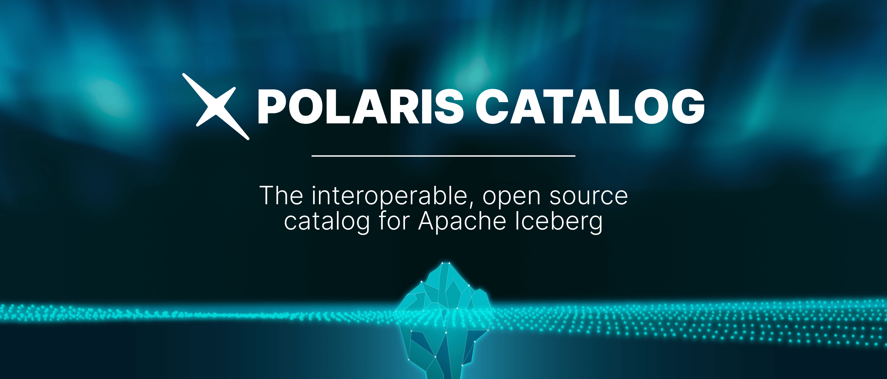

<!--

 Copyright (c) 2024 Snowflake Computing Inc.
 
 Licensed under the Apache License, Version 2.0 (the "License");
 you may not use this file except in compliance with the License.
 You may obtain a copy of the License at
 
      http://www.apache.org/licenses/LICENSE-2.0
 
 Unless required by applicable law or agreed to in writing, software
 distributed under the License is distributed on an "AS IS" BASIS,
 WITHOUT WARRANTIES OR CONDITIONS OF ANY KIND, either express or implied.
 See the License for the specific language governing permissions and
 limitations under the License.

-->

# Polaris Catalog

<a href="https://www.snowflake.com/blog/polaris-catalog-open-source/" target="_blank">Polaris Catalog</a> is an open source catalog for Apache Iceberg. Polaris Catalog implements Iceberg’s open <a href="https://github.com/apache/iceberg/blob/main/open-api/rest-catalog-open-api.yaml" target="_blank">REST API</a> for multi-engine interoperability with Apache Doris, Apache Flink, Apache Spark, PyIceberg, StarRocks and Trino. 



## Status

Polaris Catalog is open source under an Apache 2.0 license.

- ⭐ Star this repo if you’d like to bookmark and come back to it! 
- 📖 Read the <a href="https://www.snowflake.com/blog/polaris-catalog-open-source/" target="_blank">announcement blog post<a/> for more details!

## API Docs

API docs are hosted via Github Pages at https://polaris-catalog.github.io/polaris. All updates to the main branch
update the hosted docs.

The Polaris management API docs are found [here](https://polaris-catalog.github.io/polaris/index.html#tag/polaris-management-service_other)

The open source Iceberg REST API docs are found [here](https://polaris-catalog.github.io/polaris/index.html#tag/Configuration-API)

Docs are generated using [Redocly](https://redocly.com/docs/cli/installation). They can be regenerated by running the following commands
from the project root directory

```bash
docker run -p 8080:80 -v ${PWD}:/spec redocly/cli join spec/docs.yaml spec/polaris-management-service.yml spec/rest-catalog-open-api.yaml -o spec/index.yaml --prefix-components-with-info-prop title
docker run -p 8080:80 -v ${PWD}:/spec redocly/cli build-docs spec/index.yaml --output=docs/index.html --config=spec/redocly.yaml
```

# Setup

## Requirements / Setup

- Java JDK >= 21, see [CONTRIBUTING.md](./CONTRIBUTING.md#java-version-requirements). 
- Gradle - This is included in the project and can be run using `./gradlew` in the project root.
- Docker - If you want to run the project in a containerized environment.

Command-Line getting started
-------------------
Polaris is a multi-module project with three modules:

- `polaris-core` - The main Polaris entity definitions and core business logic
- `polaris-server` - The Polaris REST API server
- `polaris-eclipselink` - The Eclipselink implementation of the MetaStoreManager interface

Build the binary (first time may require installing new JDK version). This build will run IntegrationTests by default.

```
./gradlew build
```

To skip tests.

```
./gradlew assemble
```

Run the Polaris server locally on localhost:8181

```
./gradlew runApp
```

While the Polaris server is running, run regression tests, or end-to-end tests in another terminal

```
./regtests/run.sh
```

Docker Instructions
-------------------

Build the image:

```
docker build -t localhost:5001/polaris:latest .
```

Run it in a standalone mode. This runs a single container that binds the container's port `8181` to localhosts `8181`:

```
docker run -p 8181:8181 localhost:5001/polaris:latest
```

# Running the tests

## Unit and Integration tests

Unit and integration tests are run using gradle. To run all tests, use the following command:

```bash
./gradlew test
```

## Regression tests

Regression tests, or functional tests, are stored in the `regtests` directory. They can be executed in a docker
environment by using the `docker-compose.yml` file in the project root.

```bash
docker compose up --build --exit-code-from regtest
```

They can also be executed outside of docker by following the setup instructions in
the [README](regtests/README.md)

# Kubernetes Instructions
-----------------------

You can run Polaris as a mini-deployment locally. This will create two pods that bind themselves to port `8181`:

```
./setup.sh
```

You can check the pod and deployment status like so:

```
kubectl get pods
kubectl get deployment
```

If things aren't working as expected you can troubleshoot like so:

```
kubectl describe deployment polaris-deployment
```

## Creating a Catalog manually

Before connecting with Spark, you'll need to create a catalog. To create a catalog, generate a token for the root
principal:

```bash
curl -i -X POST \
  http://localhost:8181/api/catalog/v1/oauth/tokens \
  -d 'grant_type=client_credentials&client_id=<principalClientId>&client_secret=<mainSecret>&scope=PRINCIPAL_ROLE:ALL'
```

The response output will contain an access token:

```json
{
  "access_token": "ver:1-hint:1036-ETMsDgAAAY/GPANareallyverylongstringthatissecret",
  "token_type": "bearer",
  "expires_in": 3600
}
```

Set the contents of the `access_token` field as the `PRINCIPAL_TOKEN` variable. Then use curl to invoke the
createCatalog
api:

```bash
$ export PRINCIPAL_TOKEN=ver:1-hint:1036-ETMsDgAAAY/GPANareallyverylongstringthatissecret

$ curl -i -X PUT -H "Authorization: Bearer $PRINCIPAL_TOKEN" -H 'Accept: application/json' -H 'Content-Type: application/json' \
  http://${POLARIS_HOST:-localhost}:8181/api/v1/catalogs \
  -d '{"name": "polaris", "id": 100, "type": "INTERNAL", "readOnly": false}'
```

This creates a catalog called `polaris`. From here, you can use Spark to create namespaces, tables, etc.

You must run the following as the first query in your spark-sql shell to actually use Polaris:

```
use polaris;
```
