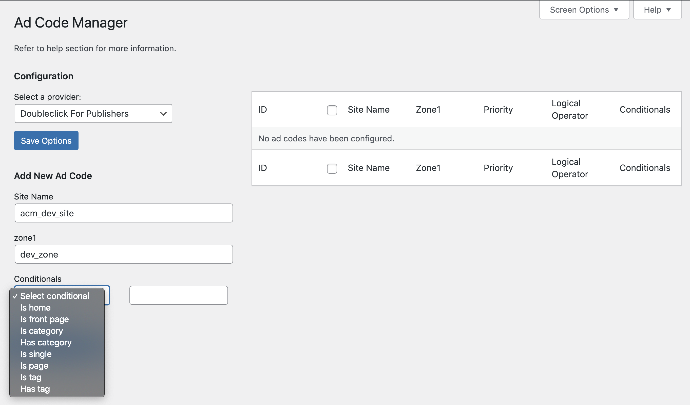
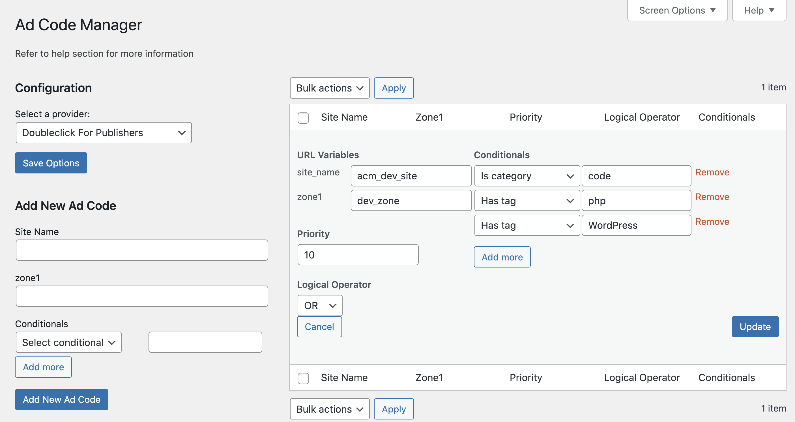
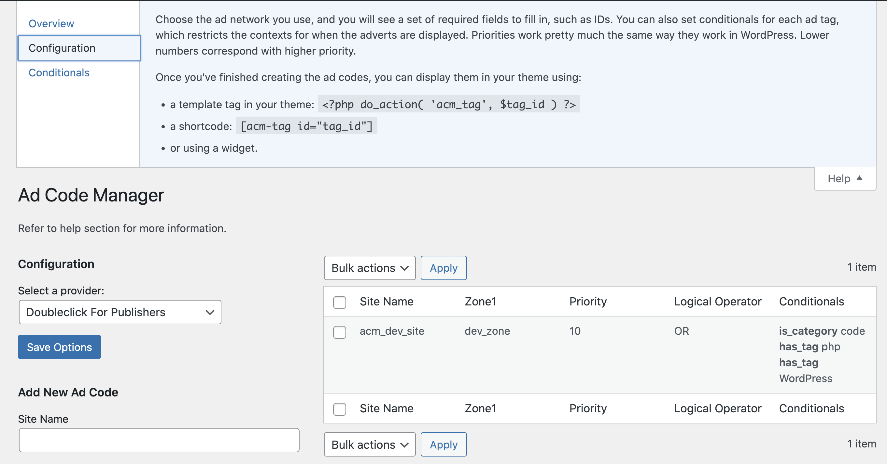

# Ad Code Manager

Stable tag: 0.5  
Requires at least: 5.5  
Tested up to: 5.9  
Requires PHP: 7.1  
License: GPLv2 or later  
License URI: https://www.gnu.org/licenses/gpl-2.0.html  
Tags: advertising, ad codes, ads, adsense, dfp, doubleclick for publishers  
Contributors: rinatkhaziev, jeremyfelt, danielbachhuber, carldanley, zztimur, automattic, doejo

Manage your ad codes through the WordPress admin in a safe and easy way.

## Description

Ad Code Manager gives non-developers an interface in the WordPress admin for configuring your complex set of ad codes.

Some code-level configuration may be necessary to set up Ad Code Manager. Ad tags must be added (via `do_action()`) to your theme's template files where you'd like ads to appear. Alternatively, you can incorporate ad tags into your website with our widget and our shortcode. Check out the configuration guide below for the full details.

A common set of parameters must also be defined for your ad provider. This includes the tag IDs used by your template, the default URL for your ad provider, and the default HTML surrounding that URL. Ad Code Manager comes with support for Google Doubleclick For Publishers (and Async), and Google AdSense. All the logic is abstracted, however, so configuring a different provider is relatively easy. Check `providers/doubleclick-for-publishers.php` for an idea of how to extend ACM to suit your needs.

Once this configuration is in place, the Ad Code Manager admin interface will allow you to add new ad codes, modify the parameters for your script URL, and define conditionals to determine when the ad code appears. Conditionals are core WordPress functions like is_page(), is_category(), or your own custom functions that evaluate certain expression and then return true or false.

[Fork the plugin on Github](https://github.com/Automattic/Ad-Code-Manager) and [follow our development blog](http://adcodemanager.wordpress.com/).

## Installation

The plugin requires PHP 7.1 or later. It is also test on WordPress 5.5 and later, though it may run on older versions.

Since the plugin is in its early stages, there are a couple additional configuration steps:

1. Upload `ad-code-manager` to the `/wp-content/plugins/` directory.
2. Activate the plugin through the 'Plugins' menu in WordPress.
3. Incorporate ad tags in your theme template with  `do_action( 'acm_tag', 'slot' )`. Also you can use `[acm-tag id="slot"]` shortcode or ACM Widget.
4. Implement filters to make the plugin work with your provider.
5. Configure your ad codes in the WordPress admin (Tools -> Ad Code Manager).

## Screenshots

1. Adding an ad code with a site name, zone, and multiple conditionals.
   

2. Edit existing ad codes inline through the admin interface.
   

3. Access the Help menu in the upper right for configuration assistance.
   

4. Example of ad tag in use in a theme header template.
   

## Configure Ad Code Manager to manage the advertisements on your site

Ad Code Manager is a VIP-sponsored plugin designed to make it easier to manage the ad codes used to display advertisements on your site. There's a little bit of work you'll need to do up front, however, in order to integrate Ad Code Manager with your theme.

The high-level idea behind Ad Code Manager is that it gives non-developers an admin interface to manage your ad codes. It then permits users to (optionally) target specific ad codes using conditionals like `is_home()` and `is_single()`. Ad codes are associated with positions in the theme through the use of ad tags.

Currently, Ad Code Manager easily integrates with Google Doubleclick For Publishers Async and Google AdSense. Other ad providers are supported with additional configuration.

### Google AdSense and DoubleClick For Publishers Async

Let's use AdSense as our first example. You'll want to incorporate some of the default ad tags into your theme by use of `do_action()`. Here's an example you might put in your header.php file:

~~~php
do_action( 'acm_tag', '728x90_leaderboard' );
~~~

Once you've done so, you can select the "Google AdSense" provider in the admin. Ad codes can be registered against ad tags (positions) by choosing the ad tag from the drop down, entering the tag ID and publisher ID, and hitting "Add New Ad Code".

And like that, your 728x90 leaderboard will appear on your site.

The Google AdSense configuration comes with many of Google's suggested sizes. Additional ad tags can be registered by the way of filtering:

~~~php
add_filter( 'acm_ad_tag_ids', 'acmx_filter_ad_tag_ids' );
function acmx_filter_ad_tag_ids( $ids ) {
	$ids[] = array(
		'enable_ui_mapping' => true,
		'tag'               => '100x100_smallsquare',
		'url_vars'          => array(
			'tag'    => '100x100_smallsquare',
			'height' => '100',
			'width'  => '100',
		),
	);

	return $ids;
}
~~~

Keep in mind that you'll still need to incorporate a `do_action( 'acm_tag', '100x100_smallsquare' );` in your theme in order to display the ad tag.

If you choose Google DFP Async as your provider, you'll likely need to register additional ad tags, as we only package two default ad tags.

### Custom Ad Provider Implementations

As mentioned previously, other ad code providers are supported with additional configuration. Here's an example of the different filters you would use to configure the older version of Google Doubleclick For Publishers:

~~~php
/**
 * Define the default URL to be used when rendering ad codes
 */
add_filter( 'acm_default_url', 'acmx_filter_default_url' ) ;
function acmx_filter_default_url( $url ) {
	if ( 0 === strlen( $url )  ) {
		return "http://ad.doubleclick.net/adj/%site_name%/%zone1%;s1=%zone1%;s2=;pid=%permalink%;fold=%fold%;kw=;test=%test%;ltv=ad;pos=%pos%;dcopt=%dcopt%;tile=%tile%;sz=%sz%;";
	}
}

/**
 * Whitelist the DFP URL to be used in ad tags. The whitelist
 * helps prevent execution of arbitrary scripts
 */
add_filter( 'acm_whitelisted_script_urls', 'acmx_filter_whitelisted_script_urls');
function acmx_filter_whitelisted_script_urls( $whitelisted_urls ) {
	$whitelisted_urls = array( 'ad.doubleclick.net' );
	return $whitelisted_urls;
}

/**
 * Define the different ad tags (locations) you'd like to use in your theme
 */
add_filter( 'acm_ad_tag_ids', 'acmx_ad_tags_ids' );
function acmx_ad_tags_ids( $ad_tag_ids ) {
	return array(
		array(
			'tag'      => '728x90-atf',
			'url_vars' => array(
				'sz'     => '728x90',
				'fold'   => 'atf',
				'width'  => '728',
				'height' => '90',
			),
		),
		array(
			'tag'      => '728x90-btf',
			'url_vars' => array(
				'sz'     => '728x90',
				'fold'   => 'btf',
				'width'  => '728',
				'height' => '90',
			),
		),
		array(
			'tag'      => '300x250-atf',
			'url_vars' => array(
				'sz'     => '300x250',
				'fold'   => 'atf',
				'width'  => '300',
				'height' => '250',
			),
		),
		array(
			'tag'      => '300x250-btf',
			'url_vars' => array(
				'sz'     => '300x250',
				'fold'   => 'btf',
				'width'  => '300',
				'height' => '250',
			),
		),
		array(
			'tag'      => '160x600-atf',
			'url_vars' => array(
				'sz'     => '160x600',
				'fold'   => 'atf',
				'width'  => '160',
				'height' => '600',
			),
		),
		array(
			'tag'      => '1x1',
			'url_vars' => array(
				'sz'   => '1x1',
				'fold' => 'int',
				'pos'  => 'top',
			),
		)
	);
}

add_filter( 'acm_output_html','acmx_filter_output_html', 5, 2 );
/**
 * Register the full script output to use with each ad tag.
 */
function acmx_filter_output_html( $output_html, $tag_id ) {
	$output_html = '<!-- DFP %pos% %sz% ad tag --> 
	');
</script><noscript></noscript>
<!-- //DFP %pos% %sz% tag -->';
	return $output_html;
}

add_filter('acm_output_tokens', 'acmx_filter_output_tokens', 5, 3 );
/**
 * Fine tune our output tokens.
 *
 * This is the real example of how easily you can modify output
 * depending on your ad network specs.
 */
function acmx_filter_output_tokens( $output_tokens, $tag_id, $code_to_display ) {
	global $dfp_tile;
	global $dfp_ord;
	global $dfp_pos;
	global $dfp_dcopt;
	global $wp_query;
	
	// We can't really rely on get_permalink() so use $_SERVER['REQUEST_URI] as bulletproof solution for generating unique pids
	$link = strlen( $_SERVER['REQUEST_URI'] ) > 1 ? sanitize_key( $_SERVER['REQUEST_URI'] ) : home_url();
	$output_tokens['%permalink%'] = str_replace( array( '/',':', '.' ), '', $link ); 
	$output_tokens['%random%']    = $dfp_ord;
	$output_tokens['%tile%']      = ++$dfp_tile;
	if (  false === $dfp_pos[ $code_to_display['url_vars']['sz'] ] ) {
		$output_tokens['%pos%']                        = 'top';
		$dfp_pos[ $code_to_display['url_vars']['sz'] ] = true;
	} else {
		$output_tokens['%pos%'] = 'bottom';
	}
	if ( ! $dfp_dcopt ) {
		$output_tokens['%dcopt%'] = 'ist';
		$dfp_dcopt                = true;
	} else {
		$output_tokens['%dcopt%'] = '';
	}
	
	$output_tokens['%test%'] = isset( $_GET['test'] ) && $_GET['test'] == 'on' ? 'on' : '';
	
	return $output_tokens;
}
~~~

## Configuration Filters

There are some filters which allow you to easily customize the output of the plugin. You should place these filters in your theme's functions.php file or in another appropriate place.

[Check out this gist](https://gist.github.com/1631131) to see all of the filters in action.

### `acm_ad_tag_ids`

Ad tag ids are used as a parameter when adding tags to your theme (e.g. `do_action( 'acm_tag', 'my_top_leaderboard' )`). The `url_vars` defined as part of each tag here will also be used to replace tokens in your default URL.

Arguments:
* array $tag_ids array of default tag ids

Example usage: Add a new ad tag called 'my_top_leaderboard'

~~~php
add_filter( 'acm_ad_tag_ids', 'my_acm_ad_tag_ids' );
function my_acm_ad_tag_ids( $tag_ids ) {
	$tag_ids[] = array(
		'tag'      => 'my_top_leaderboard', // tag_id
		'url_vars' => array(
			'sz'              => '728x90', // %sz% token
			'fold'            => 'atf', // %fold% token
			'my_custom_token' => 'something' // %my_custom_token% will be replaced with 'something'
		),
	);
	return $tag_ids;
}
~~~

### `acm_default_url`

Set the default tokenized URL used when displaying your ad tags. This filter is required.

Arguments:
* string $url The tokenized url of Ad Code

Example usage: Set your default ad code URL

~~~php
add_filter( 'acm_default_url', 'my_acm_default_url' );
function my_acm_default_url( $url ) {
	if ( 0 === strlen( $url ) ) {
		return "http://ad.doubleclick.net/adj/%site_name%/%zone1%;s1=%zone1%;s2=;pid=%permalink%;fold=%fold%;kw=;test=%test%;ltv=ad;pos=%pos%;dcopt=%dcopt%;tile=%tile%;sz=%sz%;";
	}
}
~~~

### `acm_output_html`

The HTML outputted by the `do_action( 'acm_tag', 'ad_tag_id' );` call in your theme. Support multiple ad formats ( e.g. JavaScript ad tags, or simple HTML tags ) by adjusting the HTML rendered for a given ad tag.

The `%url%` token used in this HTML will be filled in with the URL defined with `acm_default_url`.

Arguments:
* string $output_html The original output HTML
* string $tag_id Ad tag currently being accessed

Example usage:

~~~php
add_filter( 'acm_output_html', 'my_acm_output_html', 10, 2 );
function my_acm_output_html( $output_html, $tag_id ) {
	switch ( $tag_id ) {
		case 'my_leaderboard':
			$output_html = '';
			break;
		case 'rich_media_leaderboard':
			$output_html = '';
			break;
		default:
			break;
	}
	return $output_html;
}
~~~

### `acm_register_provider_slug`

Ad Code Manager has a built-in list of providers that it gathers by scanning the 'providers' directory used by the plugin. Additional providers can be added by placing the appropriate files in that directory, or by using the `acm_register_provider_slug` filter to register those that may be included as part of your theme or another plugin.

When using this plugin, you are defining the provider slug as part of the existing object as well as an array of classes associated with that provider slug.

Arguments:
* object $providers An object containing the current registered providers.

Example usage:

~~~php
add_filter( 'acm_register_provider_slug', 'my_acm_register_provider_slug' );
function my_acm_register_provider_slug( $providers ) {
	$providers->new_provider_slug = array(
		'provider' => 'My_New_Ad_Company_ACM_Provider',
		'table'    => 'My_New_Ad_Company_ACM_WP_List_Table'
	);

	return $providers;
}
~~~

### `acm_whitelisted_script_urls`

A security filter to define a safelist for which ad code script URLs can be added in the admin.

Arguments:
* array $whitelisted_urls Existing whitelisted ad code URLs

Example usage: Allow Doubleclick for Publishers ad codes to be used

~~~php
add_filter( 'acm_whitelisted_script_urls', 'my_acm_safelisted_script_urls' );
function my_acm_safelisted_script_urls( $safelisted_urls ) {
	$safelisted_urls = array( 'ad.doubleclick.net' );
	return $safelisted_urls;
}
~~~

### `acm_output_tokens`

Output tokens can be registered depending on the needs of your setup. Tokens defined here will be replaced in the ad tag's tokenized URL in addition to the tokens already registered with your tag id.

Arguments:
* array $output_tokens Any existing output tokens
* string $tag_id Unique tag id
* array $code_to_display Ad Code that matched conditionals

Example usage: Test to determine whether you're in test or production by passing ?test=on query argument

~~~php
add_filter( 'acm_output_tokens', 'my_acm_output_tokens', 10, 3 );
function my_acm_output_tokens( $output_tokens, $tag_id, $code_to_display ) {
	$output_tokens['%test%'] = isset( $_GET['test'] ) && $_GET['test'] == 'on' ? 'on' : '';
	return $output_tokens;
}
~~~

### `acm_whitelisted_conditionals`

Extend the list of usable conditional functions with your own awesome ones. We safelist these so users can't execute random PHP functions.

Arguments:
* array $conditionals Default conditionals

Example usage: Register a few custom conditional callbacks

~~~php
add_filter( 'acm_whitelisted_conditionals', 'my_acm_safelisted_conditionals' );
function my_acm_safelisted_conditionals( $conditionals ) {
	$conditionals[] = 'my_is_post_type';
	$conditionals[] = 'is_post_type_archive';
	$conditionals[] = 'my_page_is_child_of';

	return $conditionals;
}
~~~

### `acm_conditional_args`

For certain conditionals (`has_tag()`, `has_category()`), you might need to pass additional arguments.

Arguments:
* array $cond_args Existing conditional arguments
* string $cond_func Conditional function (`is_category()`, `is_page()`, etc.)

Example usage: `has_category()` and `has_tag()` use `has_term()`, which requires the object ID to function properly.

~~~php
add_filter( 'acm_conditional_args', 'my_acm_conditional_args', 10, 2 );
function my_acm_conditional_args( $cond_args, $cond_func ) {
	global $wp_query;

	// The `has_category()` and `has_tag()` functions call the `has_term()` function.
	// We should pass queried object id for it to produce correct result.
	if ( in_array( $cond_func, array( 'has_category', 'has_tag' ) ) && $wp_query->is_single == true ) {
		$cond_args[] = $wp_query->queried_object->ID;
	}

	// my_page_is_child_of is our custom WP conditional tag and we have to pass queried object ID to it.
	if ( in_array( $cond_func, array( 'my_page_is_child_of' ) ) && $wp_query->is_page ) {
		$cond_args[] = $cond_args[] = $wp_query->queried_object->ID;
	}

	return $cond_args;
}
~~~

### `acm_display_ad_codes_without_conditionals`

Change the behavior of Ad Code Manager so that ad codes without conditionals display on the front end. The default behavior is that each ad code requires a conditional to be included in the presentation logic.

Arguments:
* bool $behavior Whether or not to display the ad codes that don't have conditionals

Example usage:

~~~php
add_filter( 'acm_display_ad_codes_without_conditionals', '__return_true' );
~~~

### `acm_provider_slug`

By default, we use our bundled doubleclick_for_publishers config (check it in `/providers/doubleclick-for-publishers.php`). If you want to add your own flavor of DFP or even implement configuration for some another ad network, you'd have to apply a filter to correct the slug.

Example usage:

~~~php
add_filter(
	'acm_provider_slug',
	function() {
		return 'my-ad-network-slug';
	}
);
~~~

### `acm_logical_operator`

By default, logical operator is set to "OR", that is, ad code will be displayed if at least one conditional returns true.
You can change it to "AND", so that ad code will be displayed only if ALL of the conditionals match.

Example usage:

~~~php
add_filter(
	'acm_logical_operator',
	function() {
		return 'AND';
	}
);
~~~

### `acm_manage_ads_cap`

By default, user has to have `manage_options` cap. This filter comes in handy, if you want to relax the requirements.

Example usage:

~~~php
add_filter(
	'acm_manage_ads_cap',
	function( $cap ) {
		return 'edit_others_posts';
	}
);
~~~

### `acm_allowed_get_posts_args`

This filter is only for edge cases. Most likely you won't have to touch it. Allows to include additional query args for `Ad_Code_Manager->get_ad_codes()` method.

Example usage:

~~~php
add_filter(
	'acm_allowed_get_posts_args',
	function( $args_array ) {
		return array( 'offset', 'exclude' );
	}
);
~~~

### `acm_ad_code_count`

By default, the total number of ad codes to get is 50, which is reasonable for any small to mid-sized site. However, in some certain cases you would want to increase the limit. This will affect `Ad_Code_Manager->get_ad_codes()` `numberposts` query argument.

Example usage:

~~~php
add_filter(
	'acm_ad_code_count',
	function( $total ) {
		return 100;
	}
);
~~~

### `acm_list_table_columns`

This filter can alter table columns that are displayed in ACM UI.

Example usage:

~~~php
add_filter( 'acm_list_table_columns', 'my_acm_list_table_columns' );
function my_acm_list_table_columns( $columns ) {
	$columns = array(
		'id'           => __( 'ID', 'ad-code-manager' ),
		'name'         => __( 'Name', 'ad-code-manager' ),
		'priority'     => __( 'Priority', 'ad-code-manager' ),
		'conditionals' => __( 'Conditionals', 'ad-code-manager' ),
	);

	return $columns;
}
~~~

### `acm_ad_code_args`

This filter comes in pair with previous one, it should return array of ad network specific parameters. E.g. in `acm_list_table_columns` example we have 'id', 'name', 'priority', 'conditionals'. All of them except 'name' are generic for Ad Code Manager. Hence, `acm_provider_columns` should return only "name".

"editable" and "required" indicate whether this field should be editable and required.

Example usage:

~~~php
add_filter( 'acm_ad_code_args', 'my_acm_ad_code_args' );
function my_acm_ad_code_args( $args ) {
	$args = array(
		array(
			'key'      => 'name',
			'label'    => __( 'Name', 'ad-code-manager' ),
			'editable' => true,
			'required' => true,
		),
	);

	return $args;
}
~~~

<!-- changelog -->
